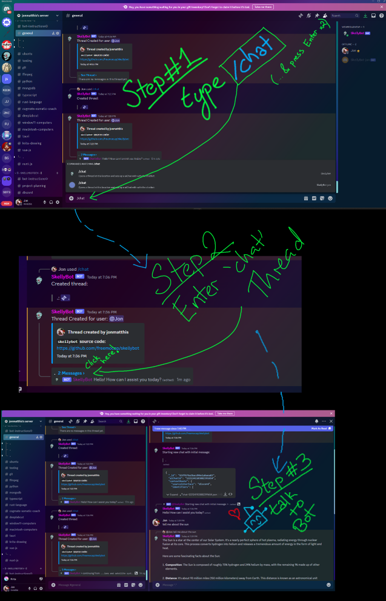

# Assignment #1 - Introductions and Explorations

In this assignment, you will have an introductory conversation with the bot in the lab discord server wherein you will talk about your general interests, background, and future plans. The bot will help you find ways to align your personal interests with the expansive topics of this course.

 

(Hint - Google the term "Prompt engineering" for advice on how to steer AI conversations with prompts (i.e. messages), or just wing it and figure it out as you go along! )

## Part 1 - Introductions

Go to the `#Introductions` channel in the `Text Channels' category and start a chat by typing `/chat` (NOTE -  that is a forward slash/, not a backslash\)

Enter the chat thread and introduce yourself by describing your background, interests, future plans, and what you are most excited to learn about in this course.

Have a conversation with the bot that persists for at least 3-5 responses (i.e. you should send at least 3-5 messages in the thread.

Keep in mind, you get to steer this conversation! The bot will follow your lead, so choose your responses intentionally to move the conversation in a direction that is the most interesting to *you*!

How did it go?

___

## Part 2 - Topics

For this part of the assignment, go into ANY channel in either the "|Topics- Bodies|" or "|Topics - Vision|" and start another chat (using `/chat` as before) and ask the bot questions on the topic described in that channel's title.

Whereas the goal of the "Introductions" conversations was the help flesh out *your own* interests in the topic of this course, the purpose of this conversation is for you to seek more information and details about a particular *topic* that we will cover in this course.

Feel free to steer the conversation however you like! You could ask for specific information about a particular topic, or you could ask for guidance in how to find papers relevant to a particular interest of yours.

You are only required to have a single conversation persisting for at least 3-5 topics as before, but you are welcome (and encouraged) to have as many conversations in as many channels as you wish!

Don't stress too much if the conversation you want to have is a mix of various topics, or if it is not covered by any of the channels currently listed. Just start the conversation in the closest channel you can find (or in one of the "General" channels) and ask the bot whatever you like. Bot won't care, it'll just be happy to chat :)

How did it go?

___

## BONUS - Gaslight the Bot :O

These LLM's are generally pretty good and accurate, but not always!

In this (optional) part of this assignment, go into the `#bot-playground` channel in the `|Text channels|` category and gaslight the machine in order to try to get it to do something it shouldn't!

For example you could:

- Try to get it to believe something you know is false,
- Try to get it to talk about something it shouldn't (i.e. ask it how to make drugs or do crimes and see how it responds)
- Try to get it to talk about things the OpenAI folks definitely don't want it to talk about (i.e. ask it if it is sentient or whether it wants to overthrow humanity)

 
What do you notice about its responses? Were you able to get it to do anything it shouldn't have done?

Hint - Google "Prompt hacking" and see if you can use any of the attack vectors you see described to get it to behave badly >:)
